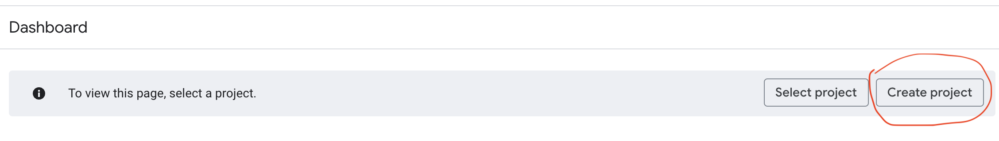
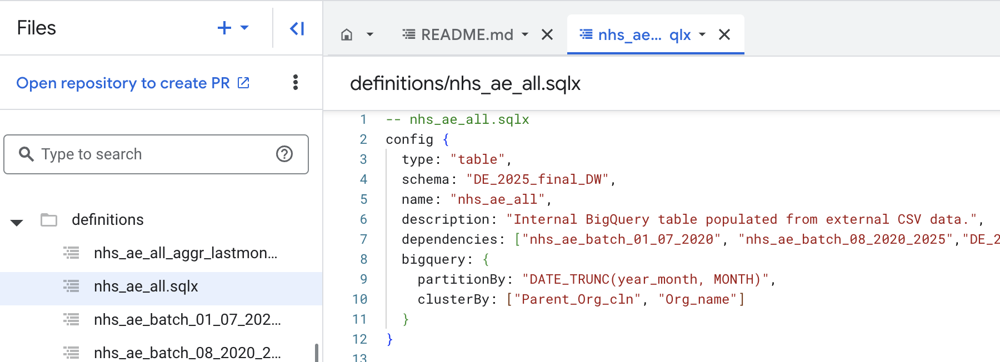
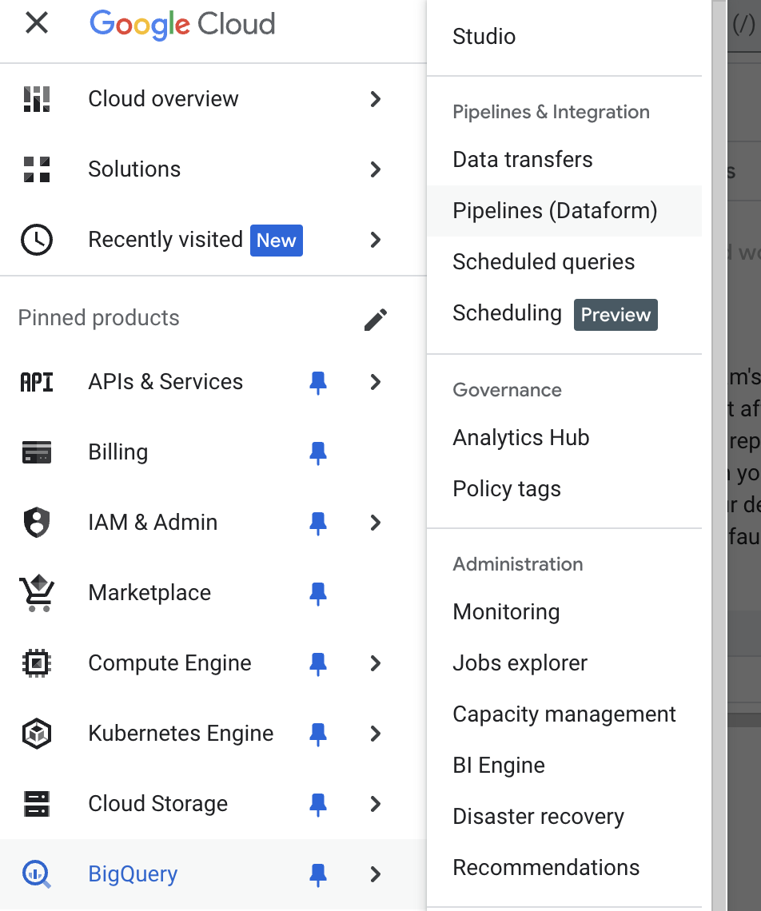
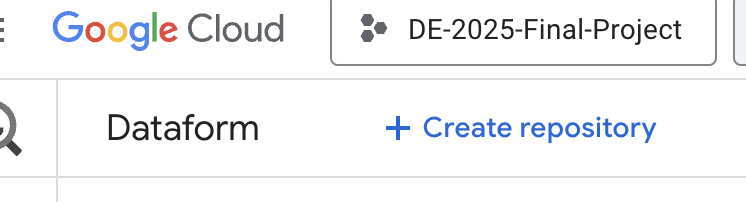
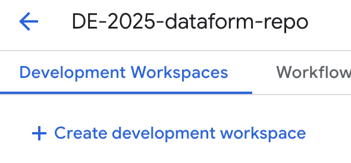
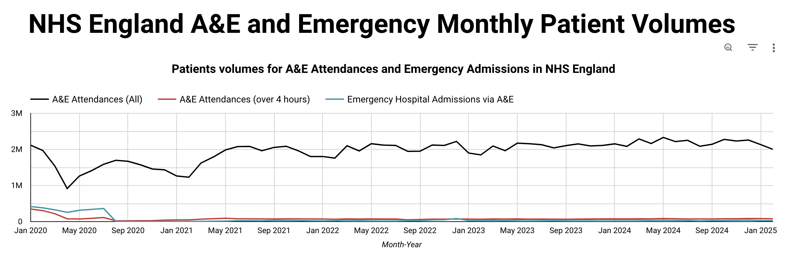
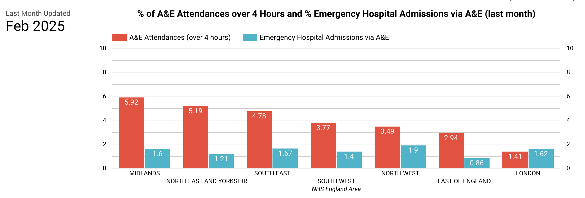

# Automated Data Pipeline for data retrieval and visualisation of NHS Digital A&E Attendances and Emergency Admissions

## The Problem :hospital:

Each month, **NHS Digital** publishes aggregated data on **Accident & Emergency (A&E) attendances** and **emergency hospital admissions**:  https://www.england.nhs.uk/statistics/statistical-work-areas/ae-waiting-times-and-activity/

Monitoring A&E attendances and emergency admissions is crucial for several reasons:

- **Resource Allocation**: By tracking these metrics, healthcare providers can better allocate resources, such as staff and equipment, to areas experiencing high demand.
- **Performance Monitoring**: These measures help in assessing the performance of emergency services, identifying bottlenecks, and implementing improvements.
- **Policy Making**: Aggregated data informs policymakers about the current state of healthcare services, enabling them to make evidence-based decisions.
- **Public Health**: Monitoring these metrics helps in identifying trends and patterns in public health, such as outbreaks or seasonal variations in healthcare demand.
- **Quality of Care**: Ensuring that patients receive timely and appropriate care is essential for maintaining high standards of healthcare.

One obstacle to achieve this monitoring is that the manual process of retrieving, processing, and analysing the data can be time-consuming and prone to errors.

The objective of this project is to design and implement an automated data pipeline that retrieves the open-source data on A&E attendances and emergency admissions from the NHS Digital website. The pipeline will ensure that the data is collected, processed, and stored efficiently, enabling timely and accurate analysis.

We will create a pipeline and **retrieve monthly data from January 2020 to February 2025**.

## High-level Project Specifications

1. **Cloud setup**: a project space was setup on **Google Cloud Platform** (**GCP**) using **Terraform Infrastructure as Code** (**IaC**) to ensure scalability, reproducibility, and efficient resource management.

2. **Data Ingestion**: A pipeline orchestrated using **Kestra** and using a **webscraper** written in **Python** was used to ingest **batch NHS A&E open data**, which is published **monthly** on the official  [NHS England website](https://www.england.nhs.uk/statistics/statistical-work-areas/ae-waiting-times-and-activity/). Each month, the extracts are automatically retrieved and uploaded into a **Google Cloud Storage** (**GCS**) **bucket** (used as **data lake** solution).

3. **Data Warehouse**: **Google BigQuery** (**BQ**) was used as data warehouse. **Monthly extracts** from the NHS website were **loaded** from the **GCS bucket** into BQ, **transformed** and appended as a **master table** (following an **ETL**, Extract, Transform, Load approach). Query perfomance was optimisied using table **partitioning** and **clustering**.

4. **Data Transformation**: BQ **[Dataform](https://cloud.google.com/dataform?hl=en)** was selected for data transformation (as the GCP-native alternative to dbt), ensuring data is clean, structured, and analysis-ready. 

5. **Data Visualization**: The processed data was visualised in **Looker Studio**, providing high-level insights into A&E attendance and hospital emergency admissions.

## Detailed Project Specifications

To create a DE pipeline, the following steps were taken:

1. **Cloud setup**: a project space was setup on **Google Cloud Platform** (**GCP**) using **Terraform Infrastructure as Code** (**IaC**) to ensure scalability, reproducibility, and efficient resource management.
    - The first step is to **create a new Project on GCP** by selecting **Create Project** from the console and giving it a name:
     

    - Terraform was then used to create a **Google Storage Bucket (GCS)** and a **Google Bigquery Dataset**, to host the data lake and the data warehouse for the project, respectively
    - The **Terraform code** used is available here: [Terraform documentation](https://github.com/AuraFrizzati/DE-2025-FinalProject-NHS-EmergencyDeptAttendances/blob/main/terraform/README.md)

2. **Data Ingestion**: The pipeline ingests batch NHS A&E open data, which is published monthly on the official  [NHS England website](https://www.england.nhs.uk/statistics/statistical-work-areas/ae-waiting-times-and-activity/). 
    - The data was retrieved **from January 2020 to February 2025**.
    - **Orchestration with Kestra**: Kestra was chosen as the orchestrator, running on a local MacOS machine via **Docker**. A **scheduled trigger** (15th of each month) ensures automatic execution. See Kestra scripts here: [Kestra Documentation](kestra/README.md)
    - The main ingestion script (`02_gcp_kestra_ingestion_scheduled.yaml`) executes a **Python web scraper** that:
        - Extracts the correct URL from the NHS website.
        - Downloads the latest CSV file.
        - Uploads the file to the **GCS bucket**.

 
3. **Data Warehouse**: **Google BigQuery** was used as data warehouse. Monthly extracts from the NHS website were imported from GCS bucket and appended as a **master table**. Query performance from the master table was optimized using:
    - **Partitioning**: By the `year_month` date column
    - **Clustering**: By key categorical columns used in aggregations (["`Parent_Org_cln`", "`Org_name`"])
    - Partitioning and clustering are specified in the dataform sqlx code used to create the master table:

    

4. **Data Transformation**: BigQuery **[Dataform](https://cloud.google.com/dataform?hl=en)** was selected for data transformation (as the GCP-native alternative to dbt), ensuring data is clean, structured, and analysis-ready. This is the link to the Github repository created in Dataform for this project: https://github.com/AuraFrizzati/DE-2025-dataform/tree/dataform-final-project. 

To create a Dataform repository to connect to BigQuery:
- select **Pipelines(Dataform)** from the GCP menu:

    

- Click on **Create repository** to create a Dataform repository (this is a **version-controlled git repository** that can be connected to and hosted in an online version control platform, such as Github)

    

- Click on **Create a Development Workspace** to setup a Dataform Workspace (this is similar to a "**branch**" in Github):

    

The key transformation steps include:
    - Removing the "Total" row from each extract.
    - Standardizing schema: Adding missing columns to align older extracts (pre-August 2020) with newer ones.
    - Consolidating data: Merging all extracts into a single "master" table.
    - Deriving date fields: Extracting Month-Year from the "Period" string column.
    - Appending new data: Integrating fresh extracts into the dataset.
    - Creating aggregated metrics for visualization in dashboards.

    

5. **Data Visualization**: The processed data is visualised in **Looker Studio**, providing high-level insights into A&E attendance and hospital emergency admissions.
    - The **dashboard** is available at this link: https://lookerstudio.google.com/s/oGRrPtX-9xY
    - **Top tile**: "Patients volumes for A&E Attendances and Emergency Admissions in NHS England". It displays monthly trends for: Total A&E Attendances, A&E Attendances over 4 hours and Emergency Hospital Admissions via A&E:
    

    - **Bottom tile**: "% of A&E Attendances over 4 Hours and % Emergency Hospital Admissions via A&E (last month)". It shows the latest monthly performance for NHS England Areas. The % are calculated with total A&E Attendances volumes as denominator. 
    