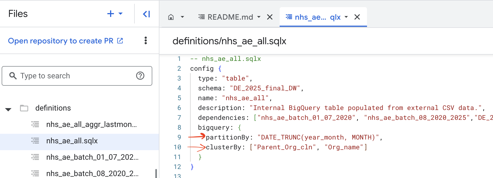
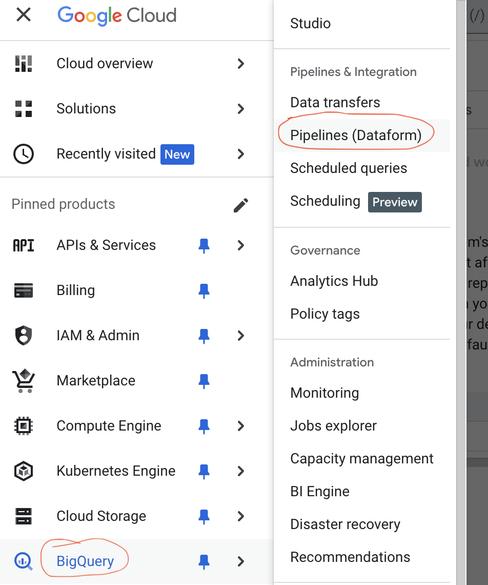
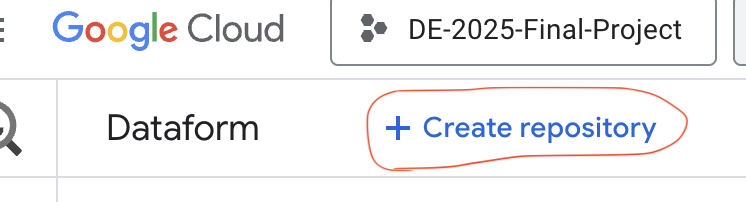
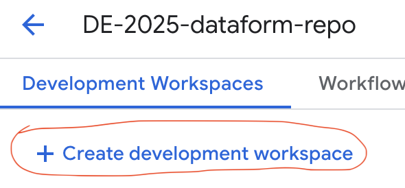
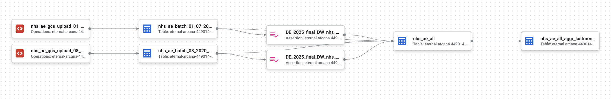
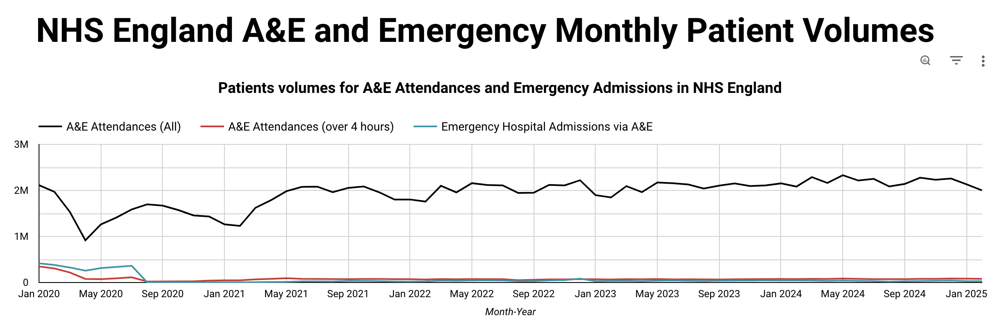
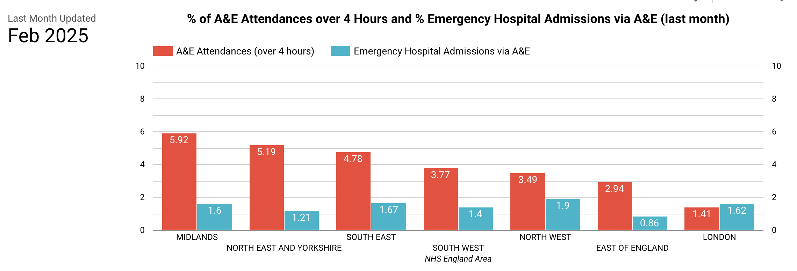

# Automated Data Pipeline for data retrieval and visualisation of NHS Digital A&E Attendances and Emergency Admissions

This project was created a submission to the online free course **[Data Engineering Zoomcamp 2025](https://github.com/DataTalksClub/data-engineering-zoomcamp/)** run by **DataTalks Club**.

## :hospital: The Problem

Each month, **NHS Digital** publishes aggregated data on **Accident & Emergency (A&E) attendances** and **emergency hospital admissions**:  https://www.england.nhs.uk/statistics/statistical-work-areas/ae-waiting-times-and-activity/

Monitoring A&E attendances and emergency admissions is crucial for several reasons:

- **Resource Allocation**: By tracking these metrics, healthcare providers can better allocate resources, such as staff and equipment, to areas experiencing high demand.
- **Performance Monitoring**: These measures help in assessing the performance of emergency services, identifying bottlenecks, and implementing improvements.
- **Policy Making**: Aggregated data informs policymakers about the current state of healthcare services, enabling them to make evidence-based decisions.
- **Public Health**: Monitoring these metrics helps in identifying trends and patterns in public health, such as outbreaks or seasonal variations in healthcare demand.
- **Quality of Care**: Ensuring that patients receive timely and appropriate care is essential for maintaining high standards of healthcare.

One obstacle to achieve this monitoring is that the manual process of retrieving, processing, and analysing the data can be time-consuming and prone to errors.

##  :dart: Main Objective

The objective of this project is to design and **implement an automated data pipeline that retrieves the open-source data on A&E attendances and emergency admissions from the NHS Digital website** (from January 2020 onwards). The pipeline will ensure that the data is collected, processed, and stored efficiently, enabling timely and accurate analysis.

## :pushpin: High-Level Project Specifications

1. **Cloud setup**: a project space was setup on **Google Cloud Platform** (**GCP**) using **Terraform Infrastructure as Code** (**IaC**) to ensure scalability, reproducibility, and efficient resource management.

2. **Data Ingestion**: A pipeline orchestrated using **Kestra** and using a **webscraper** written in **Python** was developed to ingest **batch NHS A&E open data**, which is published **monthly** on the official  [NHS England website](https://www.england.nhs.uk/statistics/statistical-work-areas/ae-waiting-times-and-activity/). Each month, the extracts are automatically retrieved and uploaded into a **Google Cloud Storage** (**GCS**) **bucket** (used as **data lake** solution).

3. **Data Warehouse**: **Google BigQuery** (**BQ**) was used as data warehouse. **Monthly extracts** from the NHS website were **loaded** from the **GCS bucket** into BQ, **transformed** and appended as a **master table** (following an **ETL**, Extract, Transform, Load approach). Query perfomance was optimisied using table **partitioning** and **clustering**.

4. **Data Transformation**: BQ **[Dataform](https://cloud.google.com/dataform?hl=en)** was selected for data transformation (as the GCP-native alternative to dbt), ensuring data is clean, structured, and analysis-ready. 

5. **Data Visualization**: The processed data was visualised in **Looker Studio**, providing high-level insights into A&E attendance and hospital emergency admissions (see dashboard at this link: https://lookerstudio.google.com/s/oGRrPtX-9xY)


## :deciduous_tree: Repository Structure

The main instructions to run this project are contained in this readme file. I am also sharing the code I used to setup Terraform (inside `terraform/`) and Kestra (inside `kestra/`). The scripts I developed for data trasformation in BQ usinf Dataform are avaiable in a separate Github repository (https://github.com/AuraFrizzati/DE-2025-dataform/tree/dataform-final-project, commit id for submission: `226eb7b`).

```plaintext
.
├── img
├── kestra
|   ├── README.md
│   ├── 01_gcp_kv.yaml
│   ├── 02_gcp_kestra_ingestion_scheduled.yaml
│   └── img
├── terraform
|   ├── README.md
│   ├── main.tf
│   ├── variables.tf
│   └── img
└── README.md
```

## :computer: Software/Platforms used

- **Google Cloud Platform** (**GCP**): 
    - **Get started** with GCP: https://www.youtube.com/watch?v=GKEk1FzAN1A
    - Create a **GCP project**: https://developers.google.com/workspace/guides/create-project
    - **Google Cloud Storage (GCS)** overview: https://cloud.google.com/storage?hl=en
    - **Big Query (BQ)** overview: https://cloud.google.com/bigquery?hl=en
    - **Dataform** overview: https://cloud.google.com/dataform?hl=en
    - **Looker Studio** overview: https://cloud.google.com/looker-studio?hl=en

- **Terraform**: 
    - Install **Terraform**: https://developer.hashicorp.com/terraform/tutorials/aws-get-started/install-cli

- **Kestra**: 
    - Install **Docker Desktop** (for running Kestra on your local machine): https://docs.docker.com/desktop/
    - Install **Kestra in a single Docker container**: https://kestra.io/docs/installation/docker 

## :microscope: Detailed Project Specifications

To create a data pipeline, the following steps were taken:

### **Step 1: Cloud setup**
A project space was setup on **Google Cloud Platform** (**GCP**) using **Terraform Infrastructure as Code** (**IaC**) to ensure scalability, reproducibility, and efficient resource management.

- The first step is to **create a new Project on GCP** by selecting **`Create Project`** from the console and **choosing a project name**:


- Terraform was then used to create a **Google Storage Bucket (GCS)** and a **BQ Dataset**, to host the **data lake** and the **data warehouse** for the project, respectively

- The **Terraform code** used to enable these steps and further instructions are available here: [Terraform documentation](https://github.com/AuraFrizzati/DE-2025-FinalProject-NHS-EmergencyDeptAttendances/blob/main/terraform/README.md)

### **Step 2: Data Ingestion**

An **orchestrated pipeline** was created to **monthly ingest batch NHS A&E open data** from the [NHS England website](https://www.england.nhs.uk/statistics/statistical-work-areas/ae-waiting-times-and-activity/).

- The data was retrieved **from January 2020 onwards**.
- The pipeline **orchestration** was carried out using with **Kestra**. Kestra was run on a local MacOS machine via a **Docker container**. A **scheduled trigger** (running on the 15th day of each month) was used to plan automatic execution. 

- The **Kestra scripts** and more details about the orchestrated pipeline are available here: [Kestra Documentation](kestra/README.md). In a nutshell, the main ingestion script (`02_gcp_kestra_ingestion_scheduled.yaml`) executes a **Python web scraper** that:
    - **Retrieves the correct URL** for the last month of data available on the NHS website
    - Uses the URL to **download the relevant CSV file on the local machine**
    - **Removes any aggregated 'Total' rows** if present
    - **Uploads the file** to the **GCS bucket**.

### **Step 3: Data Warehouse**

3. **Data Warehouse**: **Google BQ** was used as data warehouse. Monthly extracts from the NHS website were imported from GCS bucket and appended as a **master table**. Query performance from the master table was optimized using:
    - **Partitioning**: By the `year_month` date column
    - **Clustering**: By key categorical columns used in aggregations (["`Parent_Org_cln`", "`Org_name`"])
    - Partitioning and clustering are specified in the **dataform sqlx code** (`nhs_ae_all.sqlx`) used to create the master table (see next step for more information on Dataform):

    

### **Step 4: Data Transformation**

**[Dataform](https://cloud.google.com/dataform?hl=en)** was selected for data transformation (as the **BQ-native alternative to dbt**), ensuring data is clean, structured, and analysis-ready. This is the link to the Github repository created in Dataform for this project: https://github.com/AuraFrizzati/DE-2025-dataform/tree/dataform-final-project (commit id for submission: `226eb7b`) 

To create a Dataform repository to connect to BigQuery:  

1. Select **Pipelines(Dataform)** from the GCP menu:

    

2. Click on **Create repository** to create a Dataform repository (this is a **version-controlled git repository** that can be connected to and hosted in an online version control platform, such as Github)

    

3. Click on **Create a Development Workspace** to setup a **Dataform Workspace** (equivalent to a "**Github branch**"):

    

4. Create a **Dataform pipeline** using **sqlx scripts**, **dependencies** and **tests**. The key steps carried out include2:  
    - **Uploading the raw extracts from GCS** (`nhs_ae_gcs_upload_01_07_2020.sqlx`, `nhs_ae_gcs_upload_08_2020_2025.sqlx`).  
    - **Standardising tables' schema**: adding missing columns to align older extracts (pre-August 2020, `nhs_ae_batch_01_07_2020.sqlx`) with newer ones (`nhs_ae_gcs_upload_08_2020_2025.sqlx`).  
    - **Consolidating data**: Merging all extracts into a single "master" table (`nhs_ae_all.sqlx`). Before this step is carried out, the extract table are checked to ensure they do not have missing values in these key fields (sqlx code: `nonNull: ["Period", "Parent_Org", "Org_Name"]`), using [Dataform Assertions](https://cloud.google.com/dataform/docs/assertions).  
    - **Deriving date fields**: Extracting Month-Year from the "Period" string column (`nhs_ae_all.sqlx`).  
    - **Creating aggregated metrics** for the latest extracted month for visualization in dashboards (`nhs_ae_all_aggr_lastmonth.sqlx`).  

    

### **Step 5: Data Visualization**

The processed data is visualised in **Looker Studio**, providing high-level insights into A&E attendance and hospital emergency admissions.
- The **dashboard** is available at this link: https://lookerstudio.google.com/s/oGRrPtX-9xY
- **Top tile**: "Patients volumes for A&E Attendances and Emergency Admissions in NHS England". It displays monthly trends for: Total A&E Attendances, A&E Attendances over 4 hours and Emergency Hospital Admissions via A&E:

    

- **Bottom tile**: "% of A&E Attendances over 4 Hours and % Emergency Hospital Admissions via A&E (last month)". It shows the latest monthly performance for NHS England Areas. The % are calculated with total A&E Attendances volumes as denominator. 

    