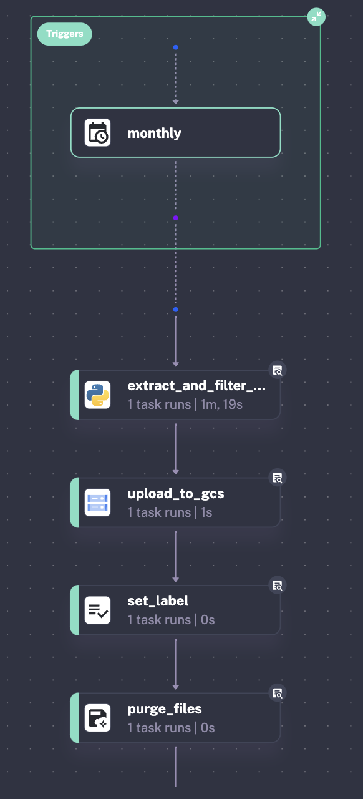

# **Kestra setup and scripts**

- Run **Kestra container** from a specific directory on your local machine (`-v`) in detached mode (`-d`):

```python
docker run --pull=always --rm -d -p 8080:8080 --user=root -v /var/run/docker.sock:/var/run/docker.sock -v /Users/aurafrizzati/Desktop/DE-2025-FinalProject/terraform:/tmp kestra/kestra:latest server local
```

- Upload the relevant **Kestra yaml files** to the Kestra Docker container:

```python
curl -X POST http://localhost:8080/api/v1/flows/import -F fileUpload=@01_gcp_kv.yaml
curl -X POST http://localhost:8080/api/v1/flows/import -F fileUpload=@02_gcp_kestra_ingestion_scheduled.yaml
```

- [`01_gcp_kv.yaml`](https://github.com/AuraFrizzati/DE-2025-FinalProject-NHS-EmergencyDeptAttendances/blob/main/kestra/01_gcp_kv.yaml): configures the **essential parameters** for interacting with **GCP**, including authentication credentials (`gcp_creds`), project ID (`gcp_project_id`), location (`gcp_location`), storage bucket name (`gcp_bucket_name`), and BigQuery dataset name (`gcp_dataset`).
- [`02_gcp_kestra_ingestion_scheduled.yaml`](https://github.com/AuraFrizzati/DE-2025-FinalProject-NHS-EmergencyDeptAttendances/blob/main/kestra/02_gcp_kestra_ingestion_scheduled.yaml): The primary orchestration file responsible for **automating** the **monthly retrieval of NHS CSV files**. It runs a **Python** script within the same Docker container as Kestra, which **web scrapes** (`beautifulsoup`) the NHS website to locate the latest CSV file, downloads it, and uploads it to the GCS bucket.

This is the **Topology** of the **main data ingestion file** (`02_gcp_kestra_ingestion_scheduled.yaml`):




