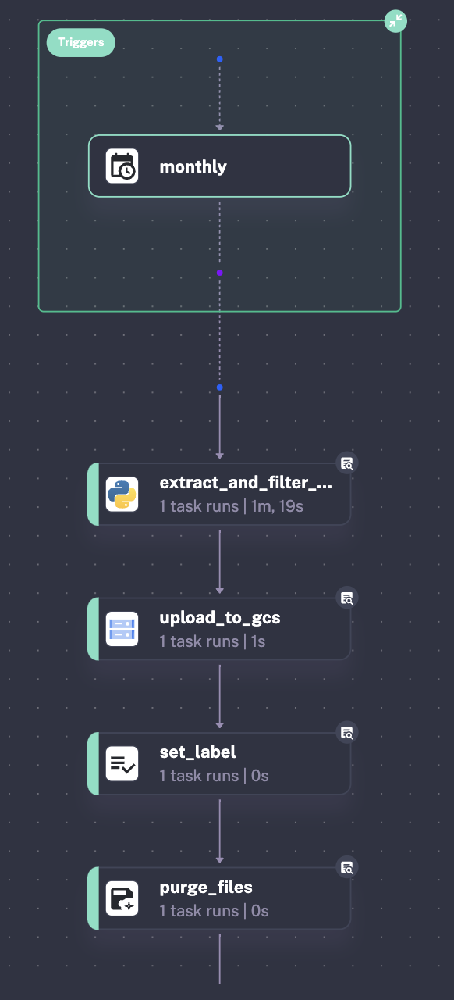
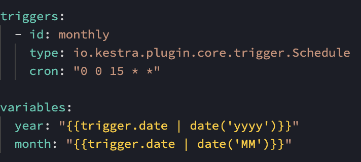
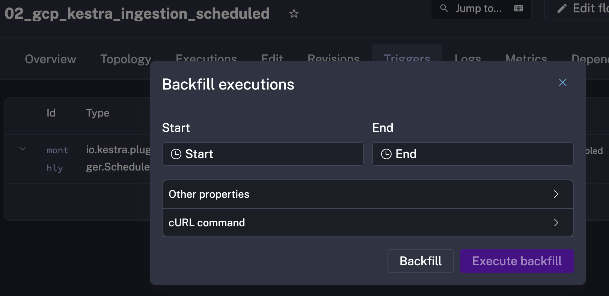
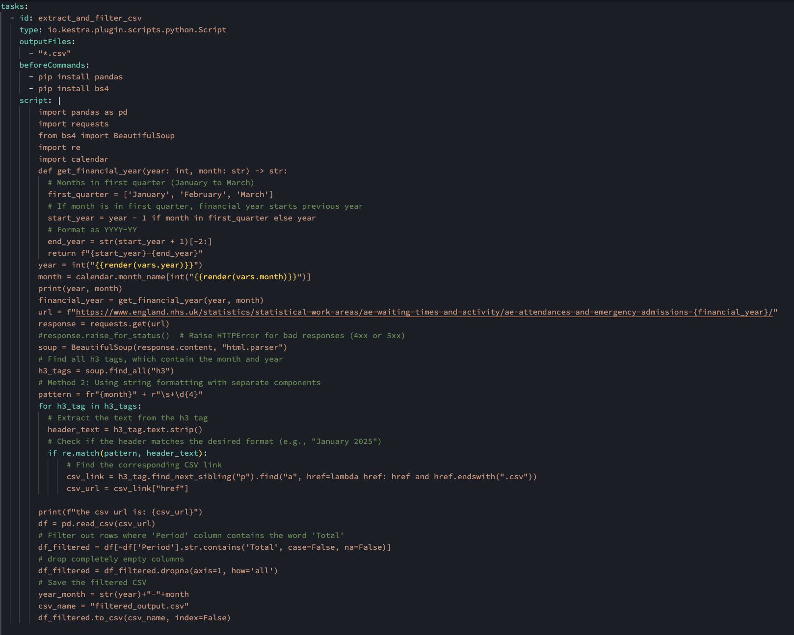
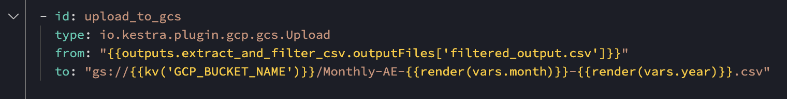
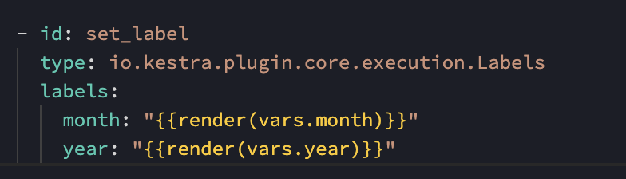
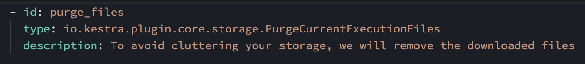

# **Kestra setup and scripts**

## **Kestra setup**

- Run **Kestra**: 
    - in a **Docker container** (`docker run`), 
    - mounting the Docker socket for task execution and a local directory for file access (commands after `-v`, for **mounting "volumes"**),
    - in **detached mode** (`-d`, so you can keep on using the same terminal from where you launched it), 
    - on **port 8080** (`-p 8080:8080`),
    - ensuring the **latest image of Kestra** is pulled from Docker hub (`--pull=always`)
    - **automatically removing the container** once stopped (`--rm`)

    ```python
    docker run --pull=always --rm -d -p 8080:8080 --user=root -v /var/run/docker.sock:/var/run/docker.sock -v /Users/my_project/terraform:/tmp kestra/kestra:latest server local
    ```

- Upload the relevant **Kestra yaml files** to the Kestra Docker container (these commands are run in the terminal from the folder specified with the previous command, `/Users/my_project/terraform` in this example):

    ```python
    curl -X POST http://localhost:8080/api/v1/flows/import -F fileUpload=@01_gcp_kv.yaml
    curl -X POST http://localhost:8080/api/v1/flows/import -F fileUpload=@02_gcp_kestra_ingestion_scheduled.yaml
    ```
## **Kestra scripts**

- [`01_gcp_kv.yaml`](https://github.com/AuraFrizzati/DE-2025-FinalProject-NHS-EmergencyDeptAttendances/blob/main/kestra/01_gcp_kv.yaml): configures the **essential parameters** for interacting with **GCP**, including authentication credentials (`gcp_creds`), project ID (`gcp_project_id`), location (`gcp_location`), Google Cloud Storage (GCS) bucket name (`gcp_bucket_name`), and BigQuery dataset name (`gcp_dataset`).

- [`02_gcp_kestra_ingestion_scheduled.yaml`](https://github.com/AuraFrizzati/DE-2025-FinalProject-NHS-EmergencyDeptAttendances/blob/main/kestra/02_gcp_kestra_ingestion_scheduled.yaml): The primary orchestration file responsible for **automating** the **monthly retrieval of NHS CSV files**. It runs a **Python** script within the same Docker container as Kestra, which **web scrapes** (`beautifulsoup`) the NHS website to locate the latest CSV file, downloads it, and uploads it to the GCS bucket.

This is the **Topology** of the **main data ingestion file** (`02_gcp_kestra_ingestion_scheduled.yaml`):



### **Step 1**
The **orchestrator pipeline** is run automatically on a **monthly schedule** via a **scheduler** triggerred on the 15th of each month. The **scheduler/trigger** sets as Kestra variables the current month and year to retrieve the relevant file on the NHS website (these variables will be used in the `extract_and_filter_csv` task).



Previous months are downloaded using the **Backfill executions** feature of **Kestra Triggers**:



### **Step 2**

The task `extract_and_filter_csv` is then executed and runs a python script in the same Docker container where Kestra is running. The python script contains a webscraper (using the library `beautifulsoup`) to extract the url for the NHS A&E csv for the current month and year. The csv is then retrieved and imported as a `pandas` dataframe.



### **Step 3**

The task `upload_to_gcs` is then run and uploads the data to the GCS  bucket



### **Step 4**

The task `set_label` is carried out to assign the **month** and **year** of the retrieved csv file to the Kestra execution (this allows to monitor the pipeline for different executions and it is especially useful to check that the backfill executions have all been carried out)



### **Step 5**

The final task is `purge_files`, which automatically removes the CSVs retrieved by the orchestrator from the local machine where it is running

