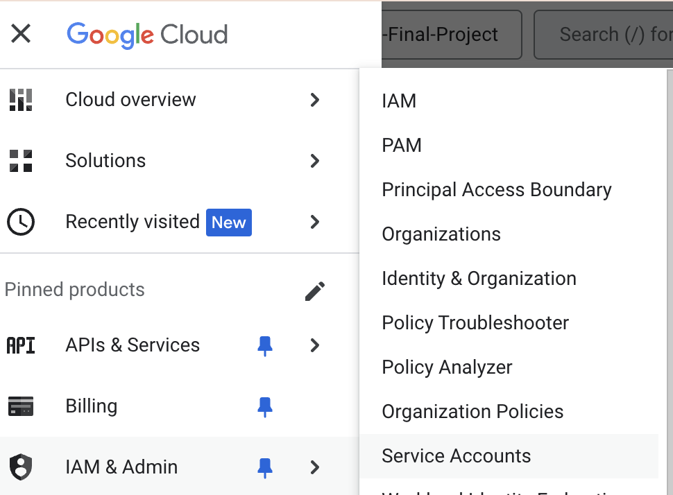

# **Terraform setup and scripts**

- A **Service Account** was created on Google Cloud Platform to enable Terraform to create a google Cloud Storage (GCS) Bucket and a BigQuery Dataset:
    - Select **IAM & Admin** --> **Service Accounts**:
    

    - Select **Create Service Account**
    

    - The Service account requires these **roles enabled**: `Bigquery Admin` (to create a BigQuery dataset), `Storage Admin` (to create a GCS bucket)

    - Create a new key as json file to connect to the Service Account for Terraform created above:
    

- Access to Google Cloud was granted to Terraform by setting in the terminal a **GOOGLE_APPLICATION_CREDENTIALS** environment variable pointing to the path where the **service-account-key-file.json** was stored on the local machine:

```
export GOOGLE_APPLICATION_CREDENTIALS="/path/to/your/service-account-key-file.json"
```

These are the terraform scripts used in this project:

- [`main.tf`](https://github.com/AuraFrizzati/DE-2025-FinalProject-NHS-EmergencyDeptAttendances/blob/main/terraform/main.tf): terraform script to specify **Google** as **infrastructure provider** and the **resources** to create (`google_storage_bucket` and `google_bigquery_dataset`)

- [`variables.tf`](https://github.com/AuraFrizzati/DE-2025-FinalProject-NHS-EmergencyDeptAttendances/blob/main/terraform/variables.tf): **Terraform variables** specified in `main.tf`

- A **Google Storage Bucket** and a **Google Bigquery Dataset** were created to host the data lake and the data warehouse for the project, respectively