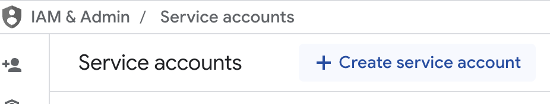
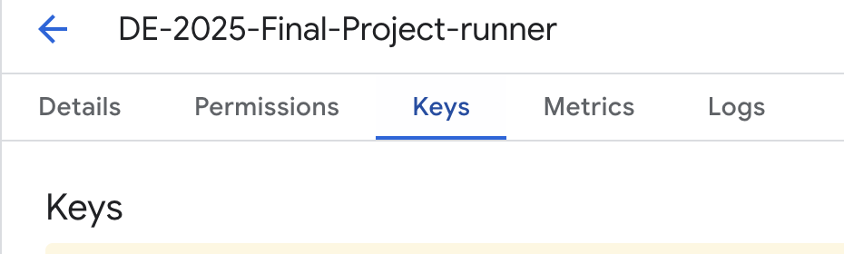

# **Terraform setup and scripts**

- A **Service Account** was created on GCP to enable Terraform to create a **GCS Bucket** and a **BQ Dataset**:

    - Select **IAM & Admin** --> **Service Accounts**:

    

    - Select **Create Service Account**
    

    - The Service account requires these **roles enabled**: `Bigquery Admin` (to create a BigQuery dataset), `Storage Admin` (to create a GCS bucket)

    - Create a new key as json file (**service-account-key-file.json**) to connect to the Service Account for Terraform created above. Save this file in a safe place and do not share it via Github!
    

- Access to Google Cloud was granted to Terraform by setting in the terminal a **GOOGLE_APPLICATION_CREDENTIALS** environment variable pointing to the path where the **service-account-key-file.json** was stored on the local machine:

```
export GOOGLE_APPLICATION_CREDENTIALS="/path/to/your/service-account-key-file.json"
```

These are the terraform scripts used in this project:

- [`main.tf`](https://github.com/AuraFrizzati/DE-2025-FinalProject-NHS-EmergencyDeptAttendances/blob/main/terraform/main.tf): terraform script to specify **Google** as **infrastructure provider** and the **resources** to create (`google_storage_bucket` and `google_bigquery_dataset`)

- [`variables.tf`](https://github.com/AuraFrizzati/DE-2025-FinalProject-NHS-EmergencyDeptAttendances/blob/main/terraform/variables.tf): **Terraform variables** specified in `main.tf`

These commands were then run from the terraform folder that contains the terraform scripts to create the infrastructure:

```terraform
# initialise Terraform State file (.tfstate):
terraform init

# Check changes to the infrastructure plan:
terraform plan 

# Apply the Terraform infrastructure plan (create bucket and BQ dataset):
terraform apply 
```